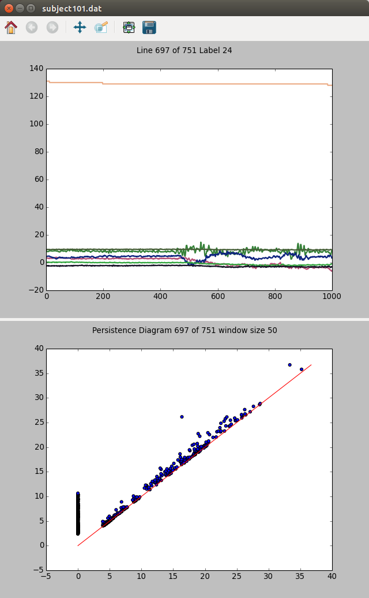

# Tutorial:

As an example, we will walk through the analysis of the PAMAP2,
[Physical Activity Monitoring Data Set](https://archive.ics.uci.edu/ml/datasets/PAMAP2+Physical+Activity+Monitoring). 
This data set contains a set of files, each consisting of lines of
multivariate data. Since the data format consists of space separated
values, we can copy the source of `ActivitySegments.py` to `PAMAPSegments.py`
and base our work from there, changing the delimiter for the Python
csv reader function.
```python
data_reader = csv.reader(data_file, delimiter=' ')
```

First, the data format has a standard 'label' field so we can hard
code that value in the Segments data structure. Next we need to handle
the case where 'NaN' indicates no sampled data for that time segment
by carrying over whatever was last read for that field.

```python
# carry over previous values for any NaNs 
prev_line = full_data[0]
line_range = range(len(prev_line))
for line in full_data[1:] :
  for (l0, l1, i) in zip(prev_line, line, line_range) :
    if l1 == "NaN" :
      line[i] = l0
    prev_line = line
```
For selection of a default save file name, the `get_filename` function in `persistence.Datatypes.Configuration` allows for a starting point to override `get_segment_filename`. The `fields` argument allows us to specify which configuration fields to use in forming the filename.
```python
@staticmethod
def get_segment_filename(config, gz=True):
    fields = ['data_file', 'data_index', 'segment_size', 'segment_stride', 'window_size', 'window_stride']
    return get_filename(config, fields, 'PAMAPSegments', gz)
```

After the segmentation module has been written, we can examine the
data for feature sizes, frequency, etc. The tool
`segment_persistence_plotter` can be useful for this. Examining the
first data file, `subject101.dat`, shows that it has 376,417
lines. Setting the segment size to 1000 and stride to 500 allows for
752 segments, each overlapping 50%. At this point, a window size of 50
is a sheer guesstimate. Finally, the data indices correspond to the
heart rate and X,Y,Z of two of the accelerometers per line of the data
file.

```sh
$ python tstop/scripts/plots/segment_persistence_plotter.py --data-index 2,4,5,6,21,22,23 --segment-size 1000 --segment-stride 500 --window-size 50 --data-type PAMAPSegments --infile data/PAMAP/subject101.dat
```
This results in the following window after waiting for a bit of computation:



Clicking in the window to bring keyboard focus and using the arrow
keys will allow you to navigate the different segments, left and right
switch labels, and up and down switch segments of the same
label. Refresh is slow due to the dynamic generation of persistence
diagrams.

Using this analysis, we choose to explore window sizes of 20, 30, 40,
and 50 samples, and then a file with only one window of data per
segment to explore learning techniques other than those based on
persistence diagrams (this can be created by setting window size to
the same as segment size).

```sh
$ python -m persistence.Datatypes.Segments --data-index 2,4,5,6,21,22,23 --segment-size 1000 --segment-stride 500 --window-size 20 --window-stride 1 --data-type  PAMAPSegments --data-file data/PAMAP/subject101.dat --out-directory 2016-05-11-PAMAP
```

```sh
$ python -m persistence.Datatypes.Segments --data-index 2,4,5,6,21,22,23 --segment-size 1000 --segment-stride 500 --window-size 30 --window-stride 1 --data-type  PAMAPSegments --data-file data/PAMAP/subject101.dat --out-directory 2016-05-11-PAMAP
```

```sh
$ python -m persistence.Datatypes.Segments --data-index 2,4,5,6,21,22,23 --segment-size 1000 --segment-stride 500 --window-size 40 --window-stride 1 --data-type  PAMAPSegments --data-file data/PAMAP/subject101.dat --out-directory 2016-05-11-PAMAP
```
```sh
$ python -m persistence.Datatypes.Segments --data-index 2,4,5,6,21,22,23 --segment-size 1000 --segment-stride 500 --window-size 50 --window-stride 1 --data-type  PAMAPSegments --data-file data/PAMAP/subject101.dat -out-directory 2016-05-11-PAMAP
```

```sh
$ python -m persistence.Datatypes.Segments --data-index 2,4,5,6,21,22,23 --segment-size 1000 --segment-stride 500 --window-size 1000 --window-stride 1 --data-type  PAMAPSegments --data-file data/PAMAP/subject101.dat --out-directory 2016-05-11-PAMAP 
```

After you have the segment files, there are a number of different
methods to generate results from them. The persistence framework in
python supports nearest neighbor classification based on distance or
similarity measures as well as SVM learning based on computed kernel
functions. The distance measures supported for segment data are
euclidean distances and dynamic time warping, and the kernel function
supported is a radial basis function kernel.

In order to establish a set of train / test splits that we can compare results of learning methods against, we can create a set of partitions that can be used with cross validation and learning tools. The same partition file can be used across the different window sizes, as only the segments are partitioned into train and test splits. The following command will generate 100 train / test partitions with half test and half train data, and a 5 fold cross validation set based on one of the train partitions.

```sh
$ python -m persistence.PartitionData --segments 2016-05-11-PAMAP/subject101-data-2_4_5_6_21_22_23-seg-1000-500-win-1000-1-PAMAPSegments.json.gz --learning-split 0.5 --learning-iterations 100 --cv-iterations 5
```

To generate the Euclidean distance matching, we generate a matrix of
distances and use that to find the nearest neighbor. The argument
`--pool` allows for the computation to be distributed among a pool of
python subprocesses. 

```sh
$ python -m persistence.EuclideanDistances --infile 2016-05-11-PAMAP/subject101-data-2_4_5_6_21_22_23-seg-1000-500-win-1000-1-PAMAPSegments.json.gz --pool 10
```
```sh
$ python -m persistence.DistanceLearning --infile 2016-05-11-PAMAP/subject101-data-2_4_5_6_21_22_23-seg-1000-500-win-1000-1-EuclideanDistances.json.gz --train-test-partitions 2016-05-11-PAMAP/subject101-data-2_4_5_6_21_22_23-seg-1000-500-win-1000-1-Partition.json.gz
```

Finally, to generate the radial basis function kernel we need to find
appropriate values for the gamma and C variables used in generating
the kernel and performing SVM, respectively, then generate the kernel
matrix and perform the SVM classification.

```sh
$ python -m persistence.CrossValidation --infile 2016-05-11-PAMAP/subject101-data-2_4_5_6_21_22_23-seg-1000-500-win-1000-1-PAMAPSegments.json.gz --pool 10 --kernel-module RBFKernel --kernel-arg "1e-6;1e6;10" --learning-module KernelLearning --learning-arg "1e-6;10;10" --train-test-partitions 2016-05-11-PAMAP/subject101-data-2_4_5_6_21_22_23-seg-1000-500-win-1000-1-Partition.json.gz
```
The output file, `2016-05-11-PAMAP/subject101-data-2_4_5_6_21_22_23-seg-1000-500-win-1000-1-simplices-500000-gamma-1e-6-C-4.64159-CrossValidation.json` contains a few statistics that can be used by `tstop/scripts/learning_from_cross_validation.py` or the cross validation values can be copy and pasted into the rest of the computation flow.

```sh
$ python -m persistence.RBFKernel -i 2016-05-11-PAMAP/subject101-data-2_4_5_6_21_22_23-seg-1000-500-win-1000-1-PAMAPSegments.json.gz --pool 10 --kernel-gamma 1e-6
```
```sh
$ python -m persistence.KernelLearning -i 2016-05-11-PAMAP/subject101-data-2_4_5_6_21_22_23-seg-1000-500-gamma-1e-06-RBFKernel.json.gz --train-test-partitions 2016-05-11-PAMAP/subject101-data-2_4_5_6_21_22_23-seg-1000-500-win-1000-1-Partition.json.gz --learning-C 4.64159
```

The remainder of the learning methods in the persistence framework are
based on the generation of persistence diagrams. These are generated
for the segment files with window sizes smaller than the segment size

```sh
$ python -m persistence.PersistenceGenerator --max-simplices 2000000 --pool 10 --infile 2016-05-11-PAMAP/subject101-data-2_4_5_6_21_22_23-seg-1000-500-win-20-1-PAMAPSegments.json.gz
```
```sh
$ python -m persistence.CrossValidation --partitions 2016-05-11-PAMAP/subject101-data-2_4_5_6_21_22_23-seg-1000-500-win-1000-1-Partition.json.gz --kernel-module PersistenceKernel --kernel-arg "1e-6;1e6;10" --learning-module KernelLearning --learning-arg "1e-6;1e6;10" --pool 10 --infile 2016-05-11-PAMAP/subject101-data-2_4_5_6_21_22_23-seg-1000-500-win-20-1-simplices-500000-PersistenceDiagrams.json.gz
```
```sh
$ python -m persistence.PersistenceKernel --infile 2016-05-11-PAMAP/subject101-data-2_4_5_6_21_22_23-seg-1000-500-win-20-1-simplices-500000-PersistenceDiagrams.json.gz --kernel-scale 4.64158883361 --pool 10
```
```sh
$ python -m persistence.KernelLearning --pool 10 --learning-C 4.64158883361 --infile 2016-05-11-PAMAP/subject101-data-2_4_5_6_21_22_23-seg-1000-500-win-20-1-simplices-500000-scale-4.64159-PersistenceKernel.json.gz --train-test-partitions 2016-05-11-PAMAP/subject101-data-2_4_5_6_21_22_23-seg-1000-500-win-1000-1-Partition.json.gz
```

These commands can be then repeated for the remaining window sizes.

